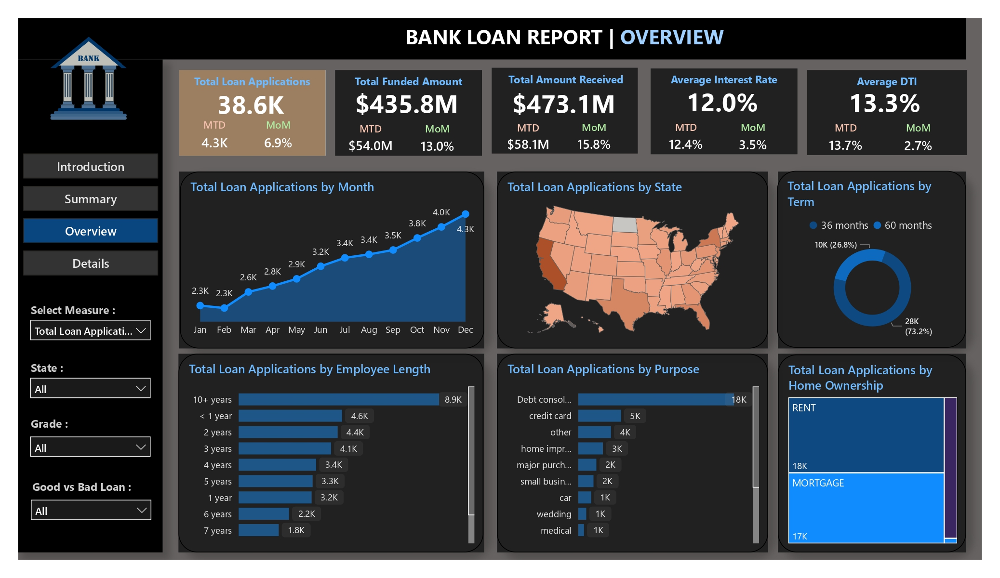

# 📊 Advanced Bank Loan Data Analysis  
*Empowering Decision-Making through Dynamic Insights*

---

## 📝 Problem Statement
The current approach to loan data analysis often lacks depth and interactivity, hindering the ability to derive meaningful insights for informed decision-making.  
Traditional reporting methods provide only limited views of lending operations, borrower behavior, and loan performance metrics.  
There is a pressing need for advanced dashboard designs to address these limitations and unlock the full potential of our loan data.

---

## 🎯 Objective
Our objective is to design and develop a suite of *interconnected dashboards* that deliver *dynamic* and *comprehensive* insights into loan data.  
These dashboards empower decision-makers with *actionable intelligence* derived from robust data analysis, offering a holistic view of:

- Lending operations  
- Borrower demographics  
- Loan performance  
- Financial health metrics  

This enables *strategic, data-driven decision-making* across all levels.

---

## 📈 Dashboard 1: Executive Summary

### 🔹 Purpose
This dashboard provides an *overview of critical Key Performance Indicators (KPIs)* essential for evaluating the overall efficiency and performance of our lending endeavors.

### 🔹 Key Features
- *Total Loan Applications:*  
Monitor total and Month-to-Date (MTD) loan applications, scrutinizing Month-over-Month (MoM) trends for actionable insights.

- *Total Funded Amount:*  
Evaluate cumulative disbursed funds and analyze MTD disbursements to identify funding patterns.

- *Total Amount Received:*  
Assess cash inflows via total and MTD received amounts from borrowers, monitoring MoM fluctuations for financial health assessment.

- *Average Interest Rate:*  
Determine the cost of lending by computing and tracking the average interest rate across all loans, including MTD and MoM changes.

- *Average Debt-to-Income Ratio (DTI):*  
Evaluate borrowers’ financial resilience by calculating the average DTI across all loans and monitoring variations.

---

## 🚀 Future Enhancements
- Deployment of interactive drill-down dashboards for borrower segmentation.
- Predictive analytics to forecast loan defaults and payment behaviors.
- Integration with external economic indicators for macro-level analysis.

---

## 📚 How to Use
- Connect to the live loan dataset (or mock dataset for development).
- Use filter options to customize the view based on time periods, borrower demographics, or loan types.
- Hover over KPIs for quick summaries and actionable insights.

---

## 🛠 Tech Stack
- *Data Sources:* Internal Loan Management Systems, CRM Systems  
- *Tools:* Power BI / Tableau / Looker / Dash (depending on implementation)  
- *Database:* SQL Server / PostgreSQL  

