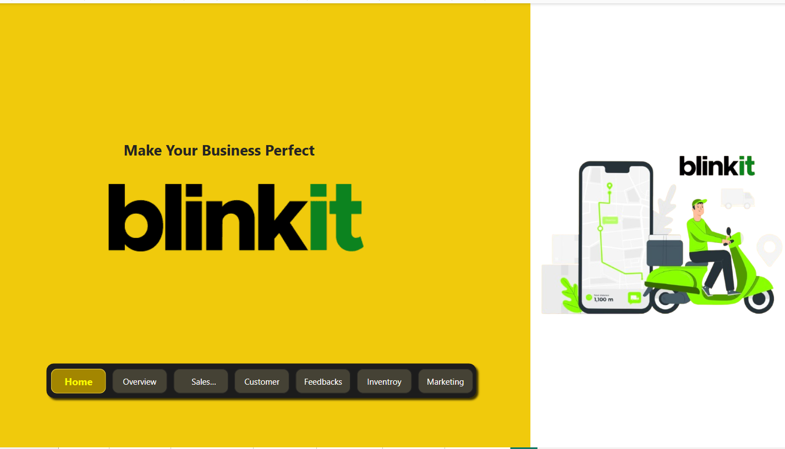
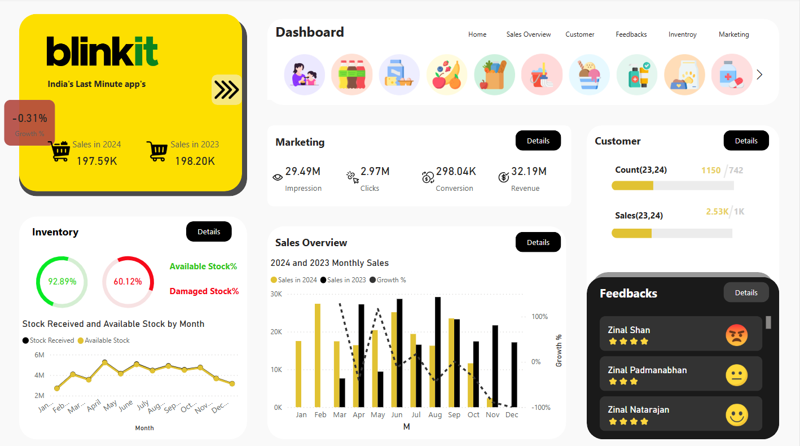
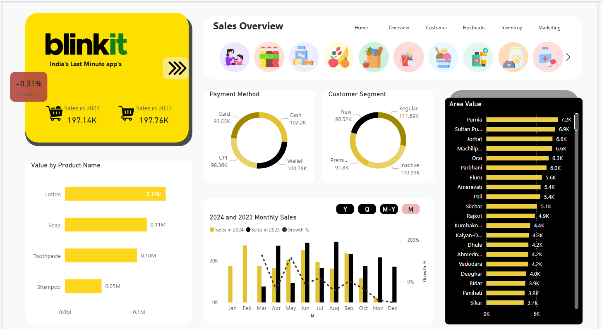
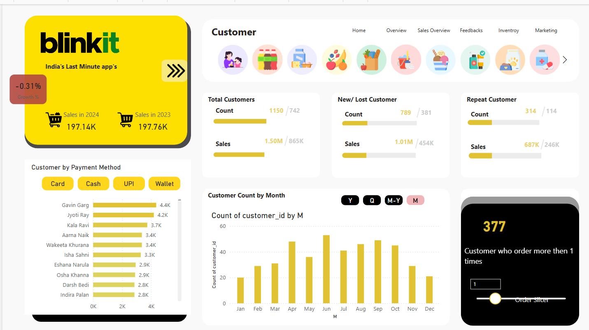
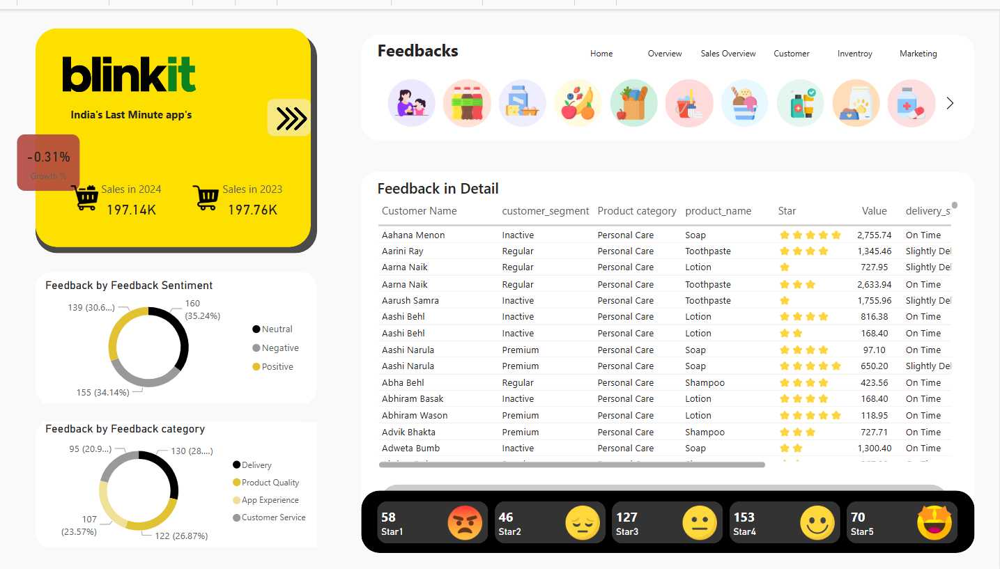
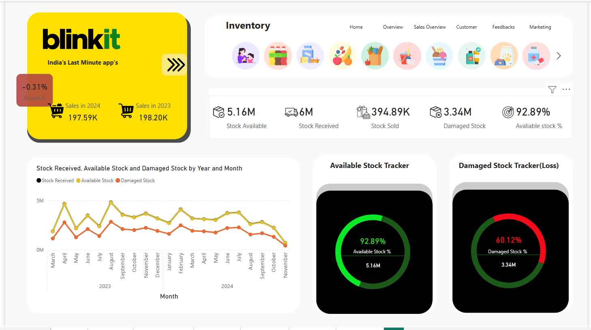
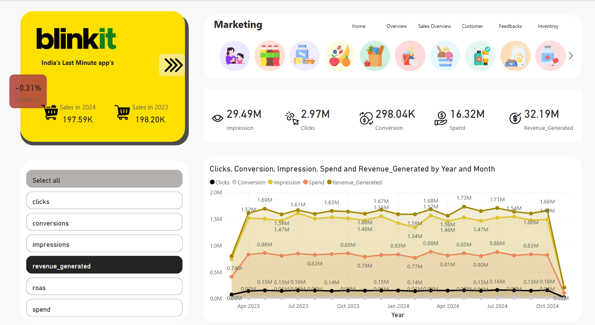

# Blinkit Performance Analytics Dashboard

## Project Overview
This dashboard provides comprehensive analytics for Blinkit's operations, offering insights into sales trends, inventory health, customer behavior, product preferences, payment methods, customer feedback, and regional performance. The dashboard facilitates data-driven decision-making for business optimization and growth strategies.

## Dashboard Components

### 1. Growth & Sales Trends
- Year-over-year sales comparison (197.14K in 2024 vs. 197.76K in 2023)
- Marginal dip of -0.31% in annual sales
- Trend analysis showing market retention in a competitive landscape
- Customer engagement metrics over time

### 2. Inventory & Stock Health Monitor
- Available stock metrics (5.16M current stock)
- Stock availability rate (92.89%)
- Loss analysis with damaged stock tracking (3.34M)
- Percentage breakdown of stock losses by category (60.12% from damage)
- Supply chain efficiency indicators

### 3. Customer Insights Panel
- Customer segmentation (1,150 total customers)
- New vs. repeat customer analysis (789 new, 314 repeat)
- Revenue contribution by customer type (687K from repeat customers)
- Order frequency metrics (377 customers with multiple orders)
- Customer retention and loyalty visualization

### 4. Product & Payment Analytics
- Top-selling product categories:
  - Lotion
  - Soap
  - Toothpaste
  - Shampoo
- Payment method distribution:
  - Cash
  - UPI
  - Cards
  - Wallets
- Product performance trends
- Payment preference shifts over time

### 5. Feedback & Sentiment Analysis
- Sentiment distribution (35% Neutral, 34% Negative, 31% Positive)
- Feedback category breakdown
  - Delivery-related feedback (highest volume)
  - Product quality feedback
- Star rating distribution (clusters at 3-4 stars with significant 1-star ratings)
- Sentiment trend analysis and correlation with operations

### 6. Regional Performance Map
- City-wise sales visualization
- Leading markets:
  - Purnia
  - Sultanpur
  - Jorhat
- Tier 2/3 city performance metrics
- Geographic expansion opportunity indicators

## Key Insights
- Strong customer retention despite slight sales decline
- Significant inventory damage issues requiring process improvements
- High value of repeat customers for revenue stability
- Balanced payment method preferences suggesting good payment flexibility
- Mixed customer feedback with actionable improvement areas in delivery
- Untapped growth potential in specific Tier 2/3 cities

## Target Users
- Blinkit executive leadership
- Operations managers
- Marketing team
- Supply chain analysts
- Customer experience specialists
- Regional market developers

## Actionable Recommendations
- Optimize inventory management to reduce damaged stock
- Enhance delivery processes to address negative feedback
- Leverage repeat customer insights for loyalty program refinement
- Focus expansion efforts on high-performing Tier 2/3 cities
- Develop targeted strategies for top-selling product categories

## Technical Implementation
- Interactive filtering capabilities
- Real-time data updates
- Cross-sectional analysis features
- Trend visualization with predictive indicators
- Exportable reports for stakeholder presentations

| Dashboard Pages |
|:---------------:|
|  |
|  |
|  |
|  |
|  |
|  |
|  |
---

## ✨ Author

*Yashvi Vekariya*  
Passionate about Data Analytics, Visualization, and Electric Mobility!

---