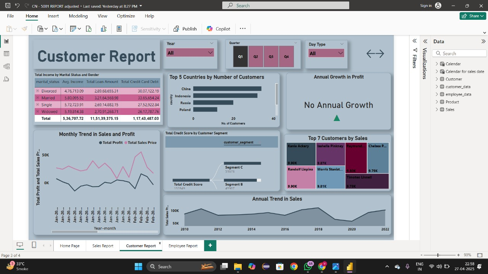
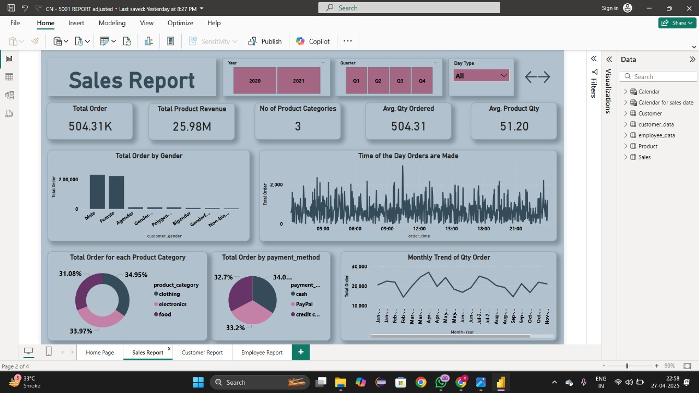
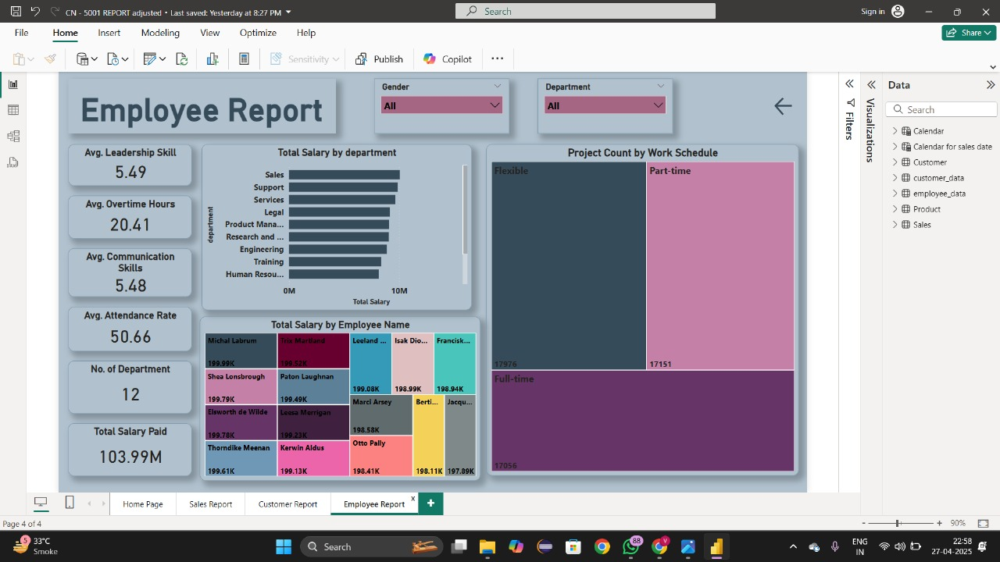

# CN-5001 Business Intelligence Dashboard

## Overview
This README provides documentation for the CN-5001 business intelligence dashboard, which offers comprehensive insights across three main areas:
- Customer Analytics
- Sales Performance
- Employee Metrics

## Dashboard Structure
The dashboard consists of 4 pages:
1. Home Page
2. Customer Report
3. Sales Report
4. Employee Report

## Key Insights

### Customer Report Insights
- China leads with the highest number of customers, followed by Indonesia, Russia, and Poland
- Married customers represent the highest total income ($5,603,095.52) and largest loan amounts ($3,214,558.98)
- No annual growth in profit is currently reported
- Top customers by sales include Kania Askery, Isabella Pinkney, and Chelsea P
- Customer data is segmented by marital status: Divorced, Married, Single, and Widowed
- Credit card debt is highest among married customers ($33,653,854.24)

### Sales Report Insights
- Total order volume is 504.31K with $25.98M in total product revenue
- Only 3 product categories are tracked: clothing (34.95%), electronics (33.97%), and food (31.08%)
- Average quantity ordered is 504.31 with average product quantity of 51.20
- Orders predominantly come from Male and Female customers, with minimal orders from other gender categories
- Payment methods are nearly equally distributed between cash (32.7%), PayPal (34.0%), and credit cards (33.2%)
- Order activity occurs throughout the day with noticeable peaks during business hours
- Monthly order quantity shows cyclical patterns with regular peaks and valleys

### Employee Report Insights
- Average leadership skill score is 5.49 out of 10
- Average communication skills score is 5.48 out of 10
- Average attendance rate is 50.66%
- Employees work an average of 20.41 overtime hours
- The company has 12 departments with a total salary expenditure of $103.99M
- Sales department has the highest total salary allocation
- Work schedules are divided between full-time, part-time, and flexible arrangements
- Top-earning employees include Michel Labrum, Shea Lonsbrough, and Vincent Le Wilde

## Data Filtering Options
The dashboard allows filtering by:
- Year (All, 2020, 2021)
- Quarter (Q1, Q2, Q3, Q4)
- Day Type (All)
- Gender (All)
- Department (All)

## Technical Notes
- Last saved: Yesterday at 8:27 PM
- File format: CN-5001 REPORT adjusted
- Pages: 4 of 4
- Contains various visualizations: bar charts, line graphs, pie charts, heatmaps, and tables
- Data is accessible via the right-side panel which includes categories for Calendar, Customer, employee_data, Product, and Sales

## Recommendations for Further Analysis
1. Investigate the "No Annual Growth" in profit indicator to identify causes
2. Analyze the high credit card debt among married customers
3. Explore why attendance rate is only 50.66% across employees
4. Consider expanding gender categories given the current binary dominance in order distribution
5. Evaluate product category distribution to identify potential new opportunities
6. Investigate seasonal trends in the monthly order patterns

