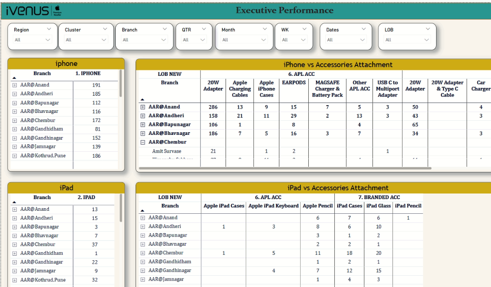
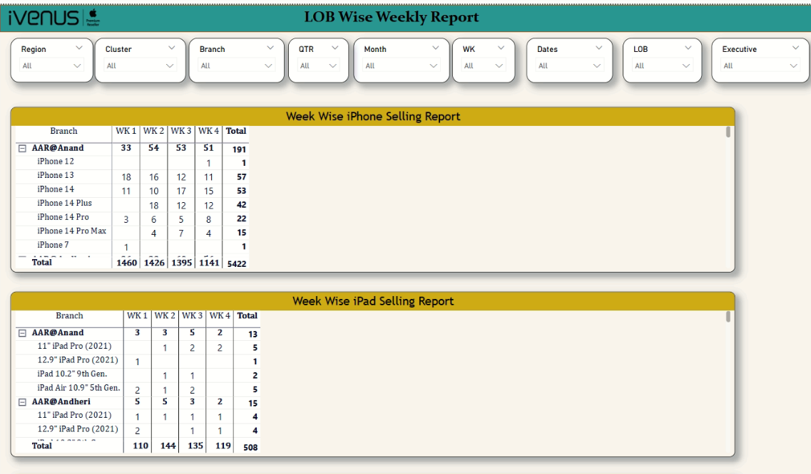
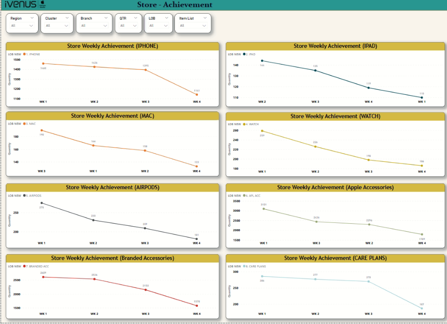
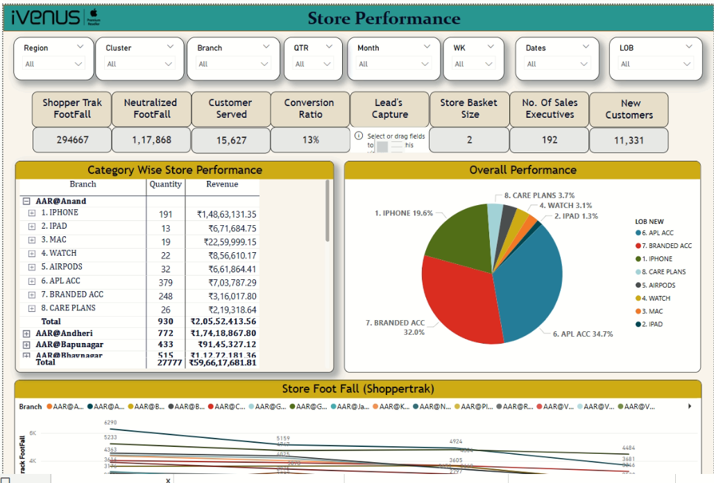

# iVenus Apple Retail Analytics Dashboard

## Project Overview
This Power BI dashboard provides comprehensive sales analytics for Apple retail operations across multiple store locations in India. The dashboard tracks sales performance of Apple products (iPhones, iPads, Macs, Watches, AirPods), accessories, and care plans across multiple branches.

## Dashboard Components

### 1. Resume/Performance Scorecard
- Overall performance score (69/100)
- Performance benchmarking against industry standards
- Improvement recommendations for hiring managers and resume screeners

### 2. LOB Wise Weekly Report
- Week-wise sales breakdown for iPhones and iPads by model
- Branch-specific performance metrics
- Total unit sales tracking across weeks (WK1-WK4)
- Detailed model-specific sales (iPhone 12, 13, 14, Pro models, etc.)

### 3. Executive Performance
- Branch-wise iPhone and iPad sales totals
- Accessory attachment metrics by store
- Cross-selling performance (devices vs accessories)
- Detailed breakdown of accessory sales by type (cases, chargers, adapters, etc.)

### 4. Store Performance
- Comprehensive store metrics including:
  - Shopper traffic (294,667 footfall)
  - Conversion ratio (13%)
  - Customer served metrics (15,627)
  - Revenue breakdowns by product category
  - New customer acquisition (11,331)
  - Sales executive performance (192 executives)

### 5. Store Achievement
- Weekly achievement trends for all product categories
- Visual representations of sales performance over time
- Week-by-week comparison of unit sales across all Apple product lines
- Trend analysis showing sales patterns across weeks

## Key Features
- Branch-specific filtering
- Time period selection (Week, Month, Quarter)
- Product category filtering
- Regional performance comparison
- Accessory attachment rate analysis
- Revenue contribution visualization

## Data Sources
The dashboard utilizes sales data from the iVenus retail management system, tracking:
- Unit sales by product category
- Revenue figures
- Customer metrics
- Accessory attachment rates
- Staff performance

## Target Users
- Store managers
- Regional managers
- Sales executives
- Inventory planners
- Marketing teams

## Dashboard Navigation
Users can filter data using the top navigation bar selectors for:
- Region
- Cluster
- Branch
- Quarter (QTR)
- Month
- Week (WK)
- Date ranges
- Line of Business (LOB)
- Executive

## Notable Insights
- Accessories represent the highest revenue contribution (34.7% for Apple accessories, 32.0% for branded accessories)
- iPhone sales trend showing decline from Week 1 to Week 4 across stores
- Anand branch showing strong iPhone performance (191 units)
- Overall declining trend visible in weekly achievement charts for most product categories

| Dashboard Pages |
|:---------------:|
|  |
|  |
|  |
|  |
---

## ✨ Author

*Yashvi Vekariya*  
Passionate about Data Analytics, Visualization, and Electric Mobility!

---
