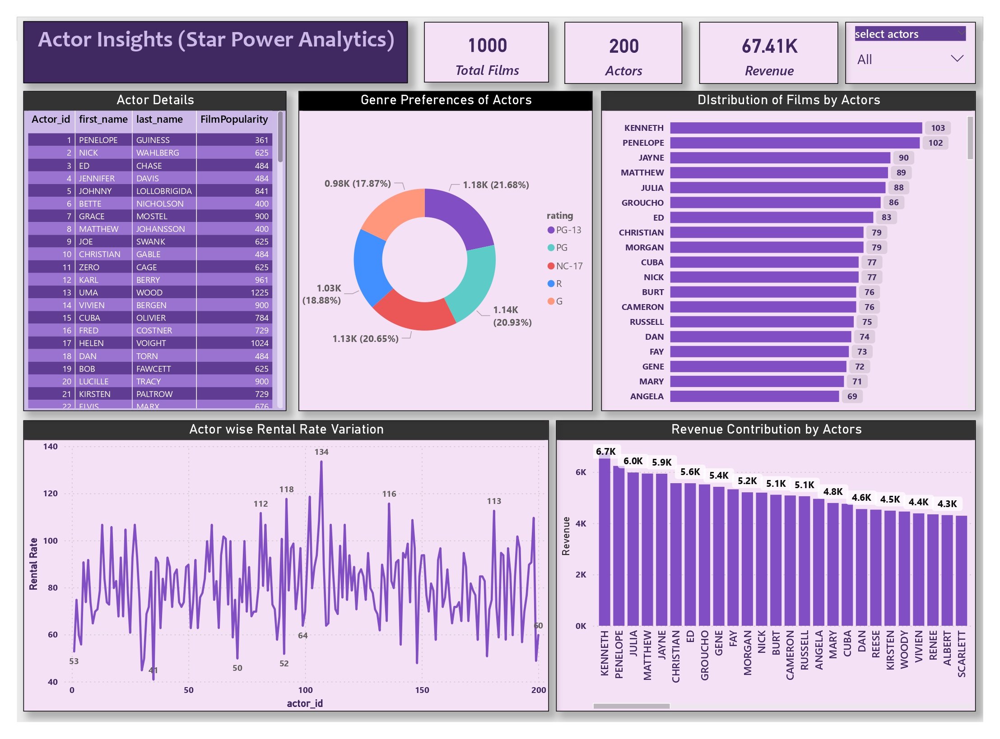
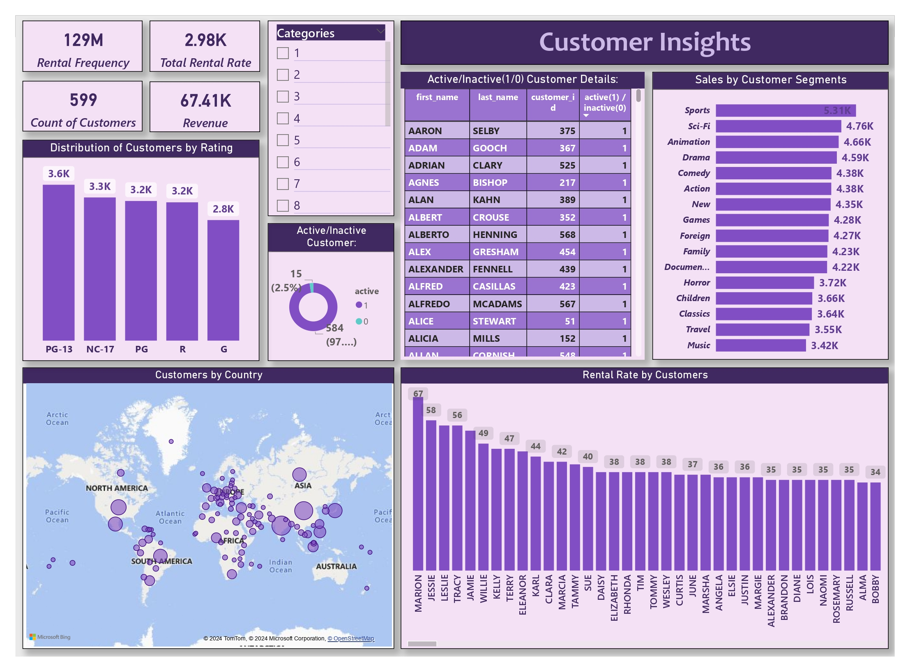
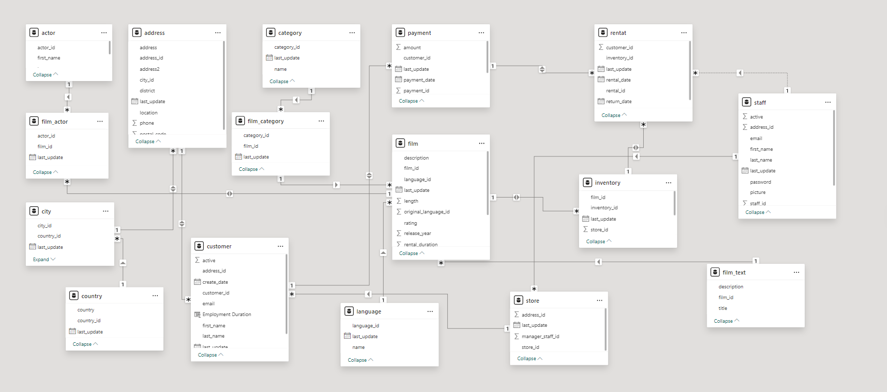
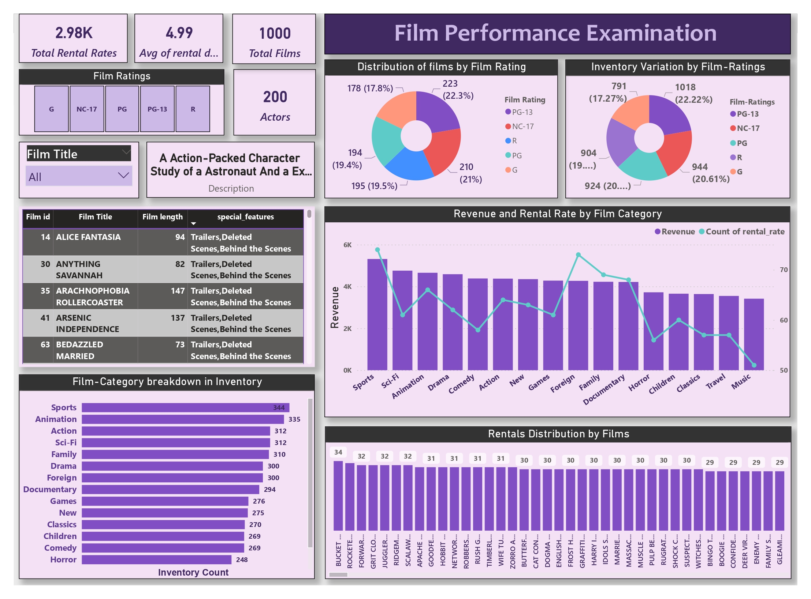
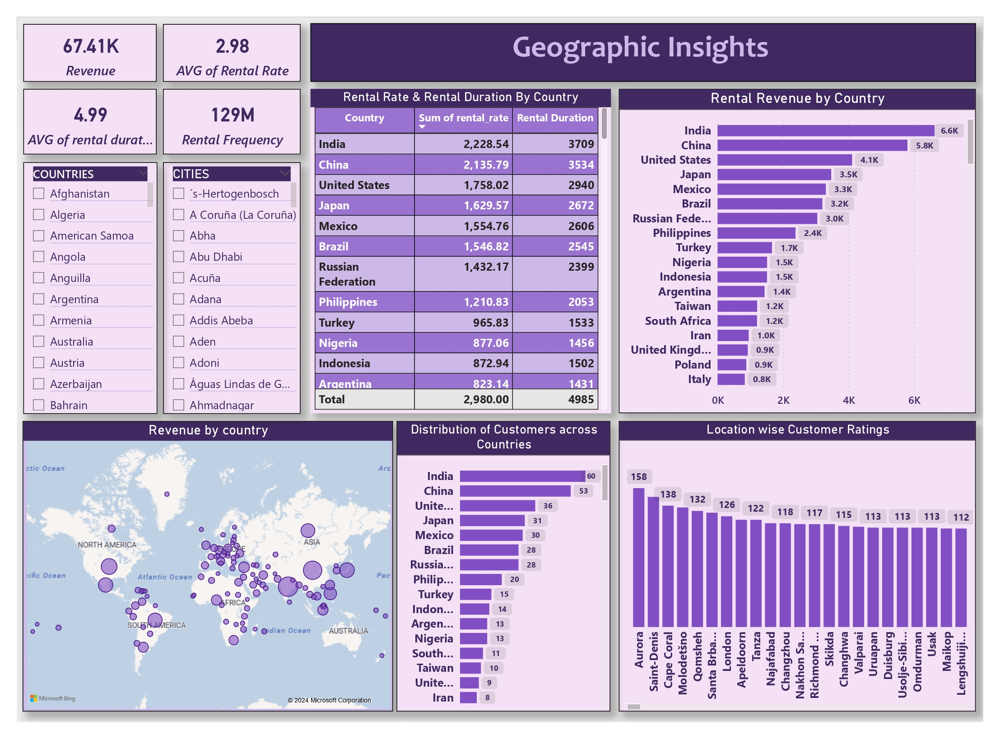
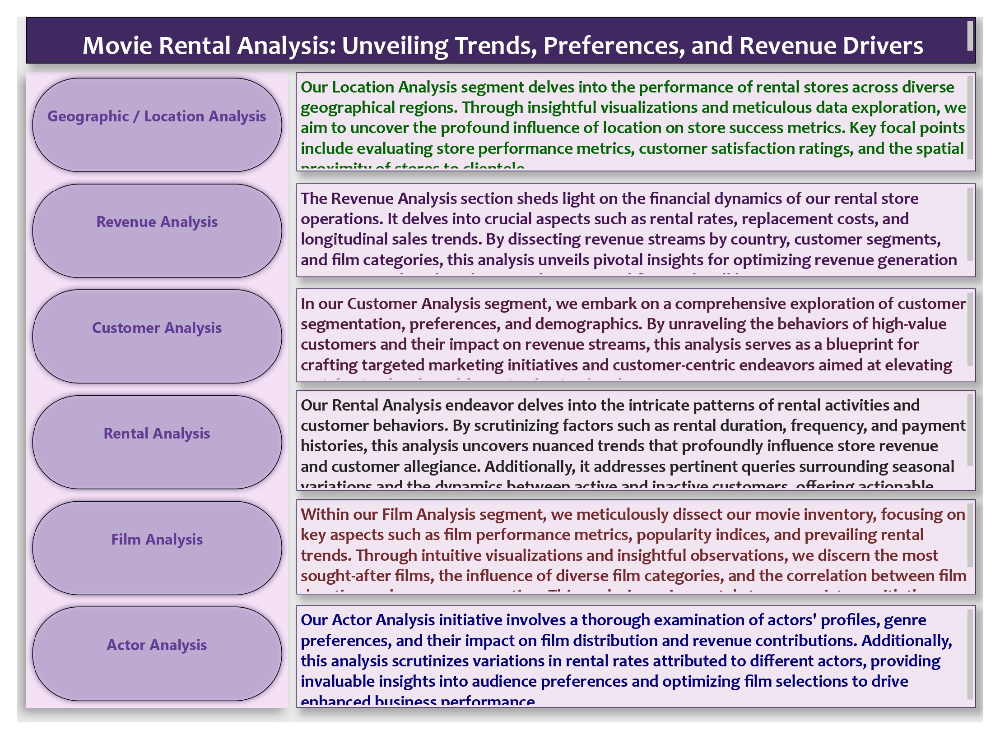
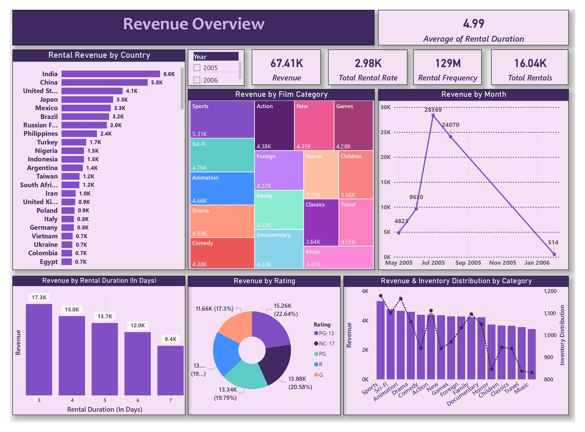
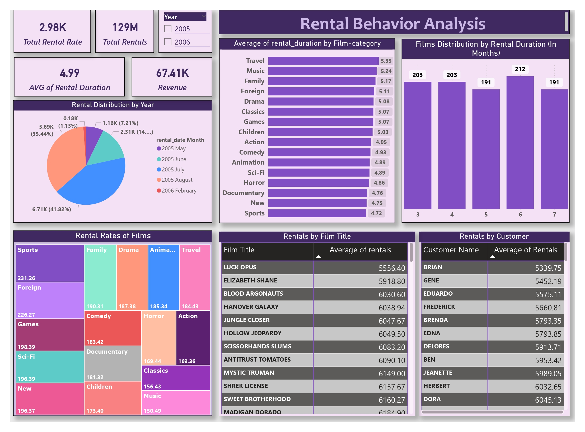

# Movie Rental Store Analytics Capstone

### Data-Driven DVD Rental Store Optimization: SQL, Excel, and Power BI Analysis

The Movie Rental Analytics capstone project presents a comprehensive exploration of the Sakila Dataset, offering invaluable insights into the DVD rental store domain. Through data analysis and visualization, we delve into customer behavior, film inventory dynamics, staff productivity, and revenue patterns. This initiative aims to provide actionable insights for strategic decision-making and operational optimization, empowering rental store owners to drive success in their businesses. With a focus on maximizing customer satisfaction and operational efficiency, our analyses pave the way for informed business strategies and enhanced profitability.

## Prerequisites
- Excel
- SQL
- Power BI
- Problem Solving

---

## Project Overview

### Problem Statement

The primary aim of this project is to engineer an exhaustive Power BI dashboard leveraging the rich dataset provided by the Sakila DVD Rental Store Database. Through rigorous Exploratory Data Analysis (EDA), encompassing meticulous examination of customer behavior, film performance metrics, and operational dynamics, our mission is to furnish rental store proprietors with discerning insights. These insights will empower them to make judicious decisions, optimize film inventory, enhance customer satisfaction, improve staff performance, and streamline store operations, thereby elevating their business operations to unprecedented levels of excellence.

---

### Dataset Description
The Sakila Dataset forms the foundation of our analysis, containing a diverse array of tables capturing various aspects of the rental store landscape, from customer demographics to film inventory specifics. Through thorough exploration, we aim to understand customer preferences, film performance, and operational trends. This understanding will fuel the creation of our Power BI dashboard, offering rental store owners actionable insights to enhance their business operations effectively.

---

### Visuals/Snapshots
## 🖼 Dashboards Preview

### Actor Analysis

### Customer Insights

### ER Diagram

### Film Performance Analysis

### Geographic Analysis

### Overview Dashboard

### Revenue Examination

### Top Rentals
