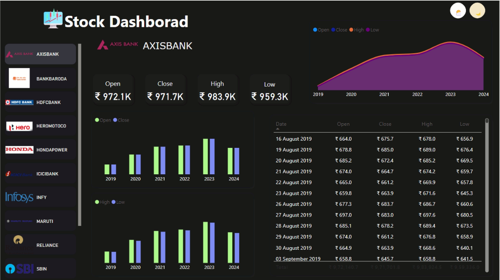
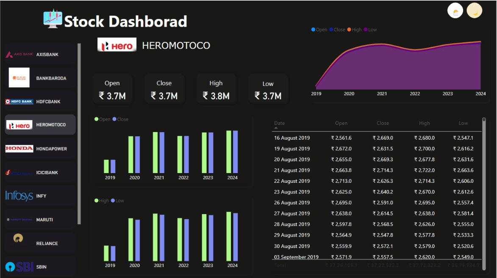
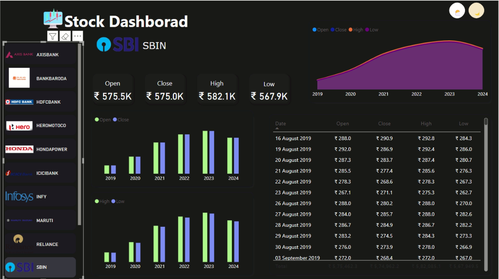
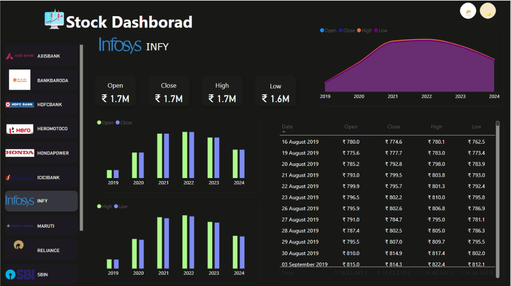

# Indian Stock Market Dashboard

## Project Overview
This Power BI dashboard provides comprehensive stock market analytics for major Indian companies including banks, IT firms, and automotive companies. The dashboard tracks historical stock prices and performance metrics across multiple years (2019-2024) with detailed daily price information.

## Dashboard Components

### 1. Stock Selector Panel
- Interactive sidebar with clickable company icons and names
- Featured companies include:
  - AXIS BANK (AXISBANK)
  - BANK OF BARODA (BANKBARODA)
  - HDFC BANK (HDFCBANK)
  - HERO MOTOCORP (HEROMOTOCO)
  - HONDA POWER (HONDAPOWER)
  - ICICI BANK (ICICIBANK)
  - INFOSYS (INFY)
  - MARUTI
  - RELIANCE
  - STATE BANK OF INDIA (SBIN)

### 2. Stock Price Overview
- Current price metrics displayed prominently:
  - Open price
  - Close price
  - High price
  - Low price
- All values shown in Indian Rupees (₹)
- Price format varies by stock (e.g., AXIS BANK: ₹972.1K, HERO MOTOCORP: ₹3.7M)

### 3. Historical Price Trend Line
- Multi-year trend visualization (2019-2024)
- Color-coded lines for Open, Close, High, and Low prices
- Shows overall price movement and volatility over a 5-year period

### 4. Yearly Price Comparisons
- Bar chart visualizations comparing yearly data
- Separate charts for Open/Close prices and High/Low prices
- Color-coded bars for easy differentiation
- Year-by-year performance at a glance

### 5. Detailed Daily Price Table
- Chronological listing of daily stock prices
- Dates starting from August 16, 2019
- Complete OHLC (Open, High, Low, Close) data for each trading day
- Scrollable interface for accessing historical records

## Key Features
- Dark mode interface for reduced eye strain
- Interactive company selection
- Multi-year performance tracking
- Daily price details
- Visual representations of price movements
- Indian Rupee (₹) formatted values

## Data Insights Visible
- AXIS BANK showing strong performance with prices around ₹972K
- INFOSYS (INFY) trading at approximately ₹1.7M
- SBI prices in the ₹575K range
- HERO MOTOCORP valued at around ₹3.7M
- Most stocks showing general upward trend from 2019 to 2023, with some volatility in 2024

## Target Users
- Stock market investors
- Financial analysts
- Portfolio managers
- Individual traders
- Financial advisors

## Technical Implementation
- Built using Power BI
- Dark theme for improved readability
- Interactive filtering through sidebar company selection
- Responsive design with multiple visualization types
- Daily data updates capability

| Dashboard Pages |
|:---------------:|
|  |
|  |
|  |
|  |
---

## ✨ Author

*Yashvi Vekariya*  
Passionate about Data Analytics, Visualization, and Electric Mobility!

---