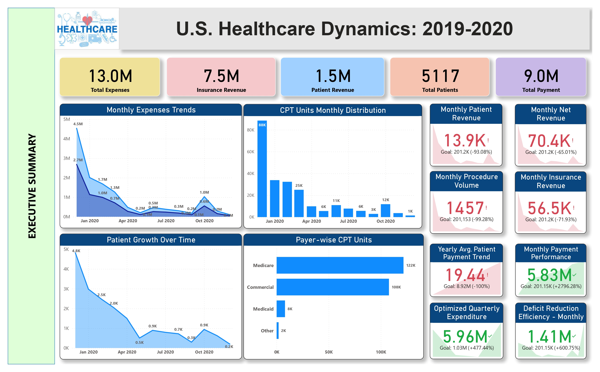
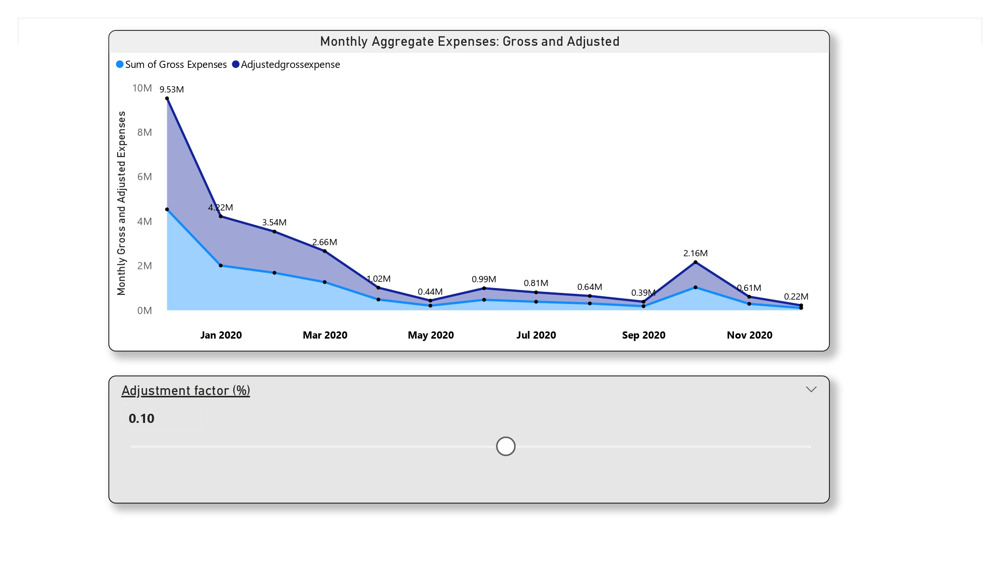
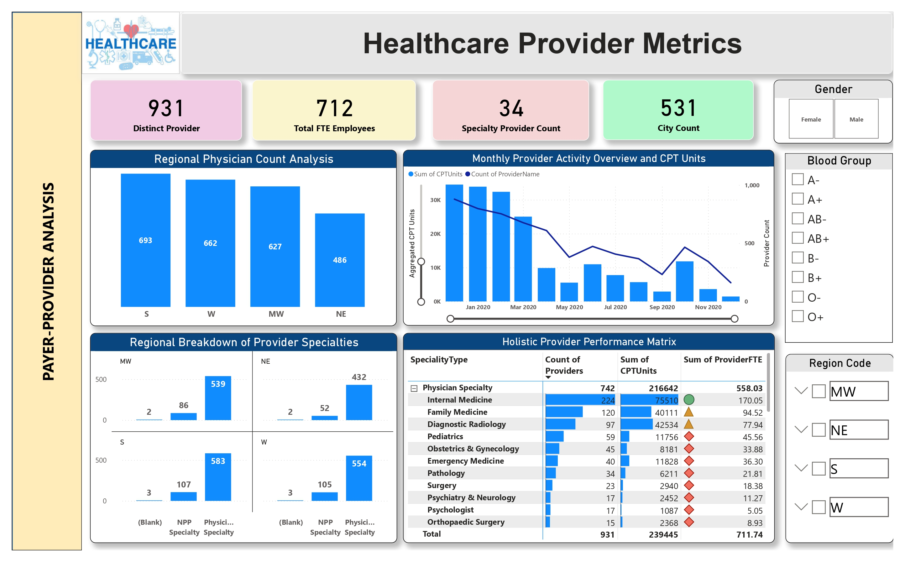
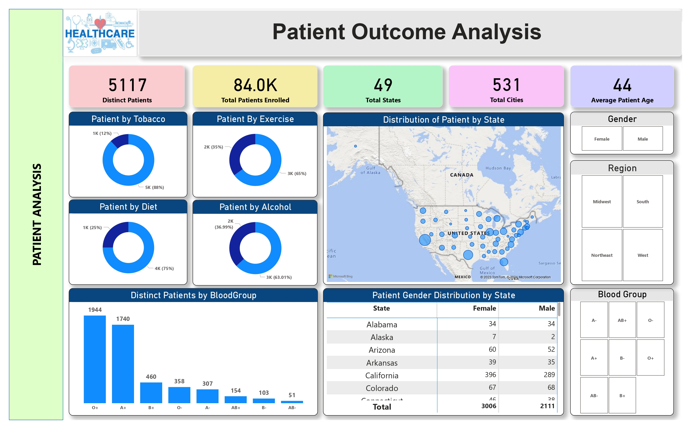
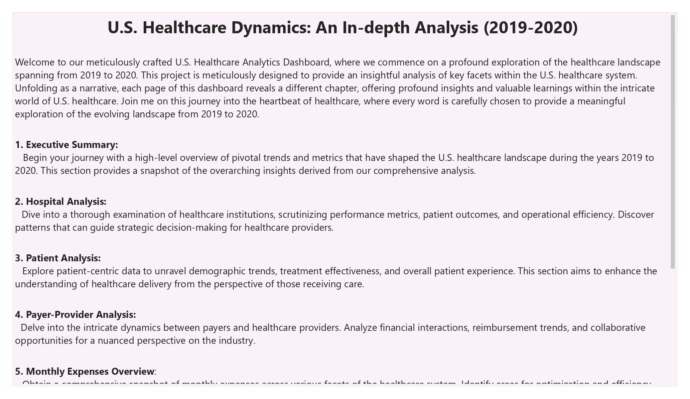
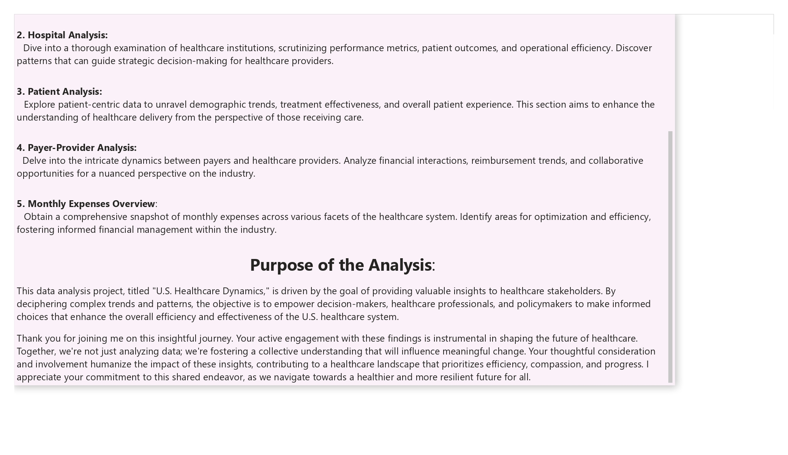
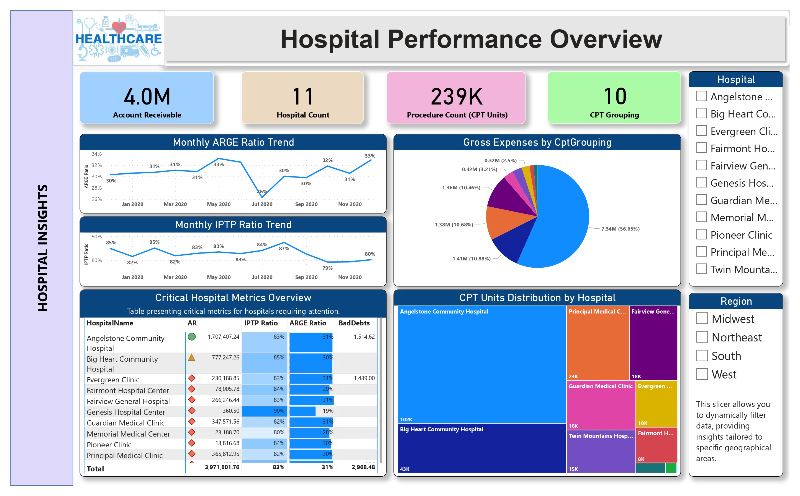
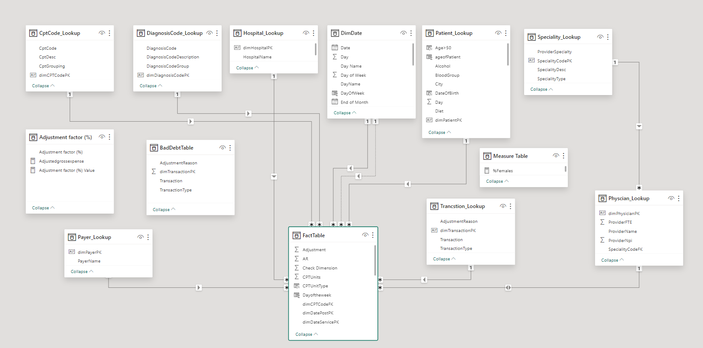

# 🏥 U.S. Healthcare Dynamics: An In-Depth Analysis (2019–2020)

Welcome to our meticulously crafted *U.S. Healthcare Analytics Dashboard*, where we embark on a profound exploration of the healthcare landscape spanning from 2019 to 2020.  
This project is designed to provide insightful analysis across key facets of the U.S. healthcare system, offering stakeholders actionable and meaningful data.

---

## 📝 Project Overview

Each page of the dashboard unfolds a different chapter, revealing profound insights and valuable learnings from the healthcare domain.

- *Executive Summary:*  
  High-level overview of pivotal trends and metrics shaping the U.S. healthcare landscape.

- *Hospital Analysis:*  
  Scrutinizes healthcare institution performance, patient outcomes, and operational efficiency for strategic decision-making.

- *Patient Analysis:*  
  Focuses on demographics, treatment effectiveness, and overall patient experience to improve healthcare delivery.

- *Payer-Provider Analysis:*  
  Analyzes the financial and operational dynamics between payers and healthcare providers.

- *Monthly Expenses Overview:*  
  Provides detailed insights into healthcare system expenditures and opportunities for financial optimization.

---

## 🎯 Purpose of the Analysis

This project aims to:
- Empower healthcare stakeholders with data-driven insights.
- Identify complex patterns and trends to enhance healthcare efficiency and effectiveness.
- Support informed decision-making among healthcare professionals and policymakers.
- Foster a collective understanding to drive meaningful change within the healthcare ecosystem.

---

## 📈 Key Metrics Tracked

- *Total Patients:* 5117 distinct patients analyzed.
- *Insurance Revenue:* $7.5M
- *Patient Revenue:* $1.5M
- *Total Expenses:* $13.0M
- *Monthly Net Revenue, Payment Performance, and Deficit Reduction Efficiency.*

---

## 📊 Dashboard Visualizations

