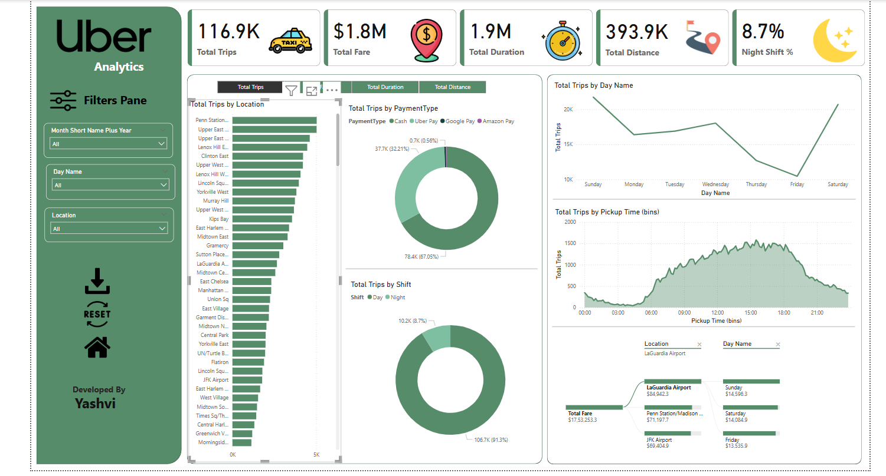

# 🚖 Uber Analytics Dashboard

This project is a data visualization dashboard for Uber trip analytics, providing key insights into trips, fare, duration, distance, and more, using an interactive Power BI dashboard.

## 📊 Dashboard Overview

The Uber Analytics dashboard is designed to help stakeholders analyze and understand Uber ride data. It includes filters and visualizations on:

### 🧾 Key Metrics
- *Total Trips:* 116.9K
- *Total Fare:* $1.8M
- *Total Duration:* 1.9M minutes
- *Total Distance:* 393.9K km
- *Night Shift Percentage:* 8.7%

### 📍 Visualizations Included
- *Total Trips by Location:* Bar chart showing trip distribution across locations.
- *Total Trips by Payment Type:* Donut chart categorizing trips by payment method (Cash, Uber Pay, Google Pay, Amazon Pay).
- *Total Trips by Shift:* Donut chart showing Day vs Night shifts.
- *Total Trips by Day Name:* Line chart showing ride frequency by days of the week.
- *Total Trips by Pickup Time:* Area chart showing distribution of pickups over 24 hours.
- *Fare & Trips by Location and Day:* Drill-down visuals showing fare and trip counts for selected locations and days.

### 🔎 Filter Pane
Interactive filters to explore the data:
- *Month*
- *Day Name*
- *Location*

## 🧰 Built With
- *Power BI* – For building the interactive visual dashboard.
- *Excel / CSV Data* – (Assumed) as the source for Uber trip data.

## 📌 How to Use
1. Open the .pbix file in Power BI Desktop.
2. Use the filters on the left panel to interact with the data.
3. Hover or click on any chart to drill down further into specific areas.
4. Reset filters using the “RESET” button.
